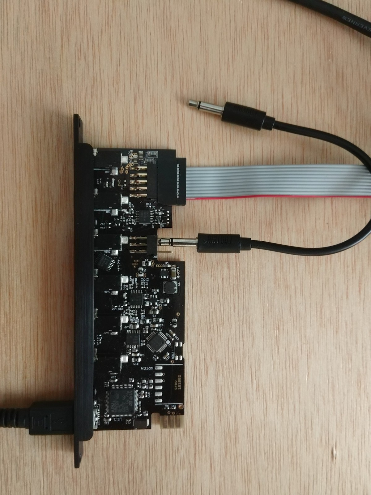

# crow

An embedded lua interpreting usb<->cv bridge (sometimes for norns).
A collaboration by whimsical raps & monome

For a developer focused intro, see [readme-development.md](readme-development.md).

## what's a crow?

crow is many things, but here's some starters:
- Eurorack module. 2hp. +60mA, -15mA (TODO confirm).
- Hardware i/o: 2inputs, 2outputs, 16bit, [-5v,+10v] range
- Full lua environment, 64kB of local script storage
- USB device, for communicating text(!)
- i2c leader & follower, multiple crows can share responsibilities
- MIDI input on TRS cable (top-most input only)

With such a wide range of features, crow may become many different things to many
different people. The focus has been to create an infrastructure where minimal
customization is required to achieve many standard functions.

In general there are two classes of use-case, crow as *satellite*, and crow
*standalone*. Separating crow's functions along this boundary is useful for
some descriptive purposes, but of course your use-case my cross the division.
It's quite possible that a *satellite* use case may want to have crow running a
local script to enrich the remote features.

### satellites

crow was originally conceptualized as a CV-expander for *norns*, enabling close
integration with modular systems, or other devices with voltage control. The
*satellite* idea is a generalization of this proposition, where crow is subsidiary
to a host device.

These modes work by sending and receiving chunks of lua code over the USB connection.
crow will execute a received chunk immediately, enabling the host environment to
direct crow to act, or query crow's state such as the level at an input jack.

#### druid

TODO

This is the standalone computer REPL. Like a command-line hosted maiden. It is
designed to be a simple interface for live-coding & configuring crow.

General use-case would be a split terminal with text-editor on one side, and
druid on the other. druid provides direct access to crow's REPL so you can test out
code directly, then copy & paste into your script. Some hotkeys for auto-uploading
a file to crow would be useful.

crow has a lot of built-in documentation which can be queried with the 'help()'
method on most of the libraries. This will cause crow to send a chunk of lua code
which will be printed in the REPL window. These code chunks are specifically made
to enable a user to copy/paste them directly into their script.

#### norns

TODO

norns will add a set of functions for communicating with crow.

norns will create a set of event handlers that the user can redefine.

#### Max

A max object called [crow] is included in this project, though in future will be
included in the Max distribution. It is a thin layer over a [serial] object which
communicates to crow. The [crow] object accepts specific messages to query inputs,
set functionality, and drive outputs. Additionally chunks of lua code can be sent
directly to the object to control crow in a totally open manner.

The object then returns the default events (inputs, trigger events, timers etc)
in a form easily integrated into a Max patch. A simple usage would send new values
to the output jacks, and turn on 'change' mode for the inputs such that bangs are
received when the inputs pass a threshold.

#### Ableton

Leveraging the above max object, a set of Max4Live devices will soon be created
enabling some simple yet powerful interfacing between Ableton and a modular synth.

Initially these will be focused around using Ableton as the center of a system:
- Creating clocks, and clock-synced ramps
- Automatable CV outputs with variable smoothing
- Recording CV inputs as MIDI
- Using CV inputs to remote-control Ableton

In future this could be extended to allow the modular to drive Ableton directly
via clocks, but perhaps some other parameters too. We're hoping some more active
Ableton users will help extend these ideas, if not the implementation.

### Standalone

*Standalone* mode is intended to let crow perform functions without needing to
connect to a host device. To support this, the user can upload scripts to crow
which will run whenever the system is powered up.

The defining difference of using crow standalone is the manner in which events are
handled. While in *satellite* mode, events send messages over USB, when *standalone*
the user must handle these events in their script.

In order to get your standalone program onto crow you'll need a text editor and a
mechanism to talk to the serial port. *druid* above will be the typical choice for
those familiar with the command line. The Max object can be used too if you are
comfortable in that environment. Eventually maiden may support uploading directly
to crow(?).

**would love to hear thoughts on what kind of tool is best suited for this**

## Standalone: Writing crow scripts

A typical crow script is broken up into two main sections:

TODO

extend this...

### 1: The init() function
Here the script initializes parameters & you can describe the general functionality
of your script this will likely include declaring events that will be called at
runtime.

### 2: Event handlers
These functions handle events created by:
- timers
- input jacks
- i2c
- midi input

## crow commands: Controlling the crow environment

The below commands should be integrated into a host environment as macros or
commands. In particular, the user shouldn't need to worry about typing them
explicitly. norns should provide higher-level functions that send these low-level
commands & split up larger code pieces automatically.

The following commands are parsed directly from usb, so should work even if the lua
environment has crashed. nb: start/end script won't work correctly if the env is
down though. Use clearscript first.

nb: only the first char after the `^^` symbol matters, so the host can
simply send a 3 char command (eg `^^s`) for brevity & speed

- `^^startscript`: sets crow to reception mode. following code will be saved to a buffer
- `^^endscript`: buffered code will be error-checked, eval'd, and written to flash. crow returns to repl mode.
- `^^clearscript`: clears onboard flash without touching lua. use this if your script is crashing crow.
- `^^printscript`: requests crow to print the current user script saved in flash over usb to the host. prints a warning if no user script exists.
- `^^bootloader`: jump directly to the bootloader.
- `^^reset` / `^^restart`: reboots crow (not just lua env). nb: causes usb connection to be reset.


### recovering from an unresponsive state

It's entirely possible to upload crow scripts that will make crow unresponsive
and require clearing of the on-board script.

#### Requesting user-script-clear

The gentlest way to deal with this situation is to send the `^^clearscript`
command over usb. You <will be able to> do this by typing `;c` or `^^c` in the
crow application<, or pressing a 'clear script' button in maiden?>, or pressing
the (^^clearscript) message box in max.

#### Using the bootloader

In extreme cases, your script might even make the low-level system become
unresponsive which will stop crow from responding to your `^^clearscript`
command.

See *Bootloader* at the bottom of this document.

## Input Library

crow's cv inputs can be used in three different ways: 'none', 'stream' and 'change'.
This setting is chosen independently for each of the two inputs, allowing each jack
to take on different roles.

- 'none' is the default, requiring you to manually query input values.
- 'stream' returns values at regular time intervals.
- 'change' sends an event when the input crosses a predefined threshold.

This choice of functionality is referred to as the input's 'mode'. to set input 1 to
'none' mode you can use `input[1].mode('none')`.

Or set the second input to 'stream' mode where values will be sent 10 times a second
(aka every 0.1 seconds) `input[2].mode('stream', 0.1)`.

In this way the `mode` function takes a variable number of arguments, depending on
which mode you've selected. If you don't supply all the arguments, the last value
you used will be applied, falling back to the default if it's your first time.

Remembering the number and order of these arguments can be a pain, so you can also
setup the mode in a different manner, explicitly naming your parameters:
```
input[2]{ mode    = 'stream'
        , time    = 0.1
        }
```
The above code will act identically to our above `mode` function call, but now it's
clear to us (and *future* us) what the `0.1` refers to, time!

This style is more useful for 'change' mode as there are more arguments:
```
input[1]{ mode       = 'change'
        , threshold  = 1.0
        , hysteresis = 0.2
        , direction  = 'rising'
        }
```
`input[1]` chooses the first channel (upper most jack on crow).
`mode = 'change'` means we'll receive events when the threshold is crossed.
`threshold = 1.0` sets the detection level to 1 volt. above this is 'high', and below is 'low'
`hysteresis = 0.2` modifies the 'threshold' value depending on which direction the
signal is moving. If the signal is low, output won't switch high until reaching 1.1V,
but once the signal has gone high it won't switch low until passing beneath 0.9V.
The difference here is 0.2V and is known as hysteresis. Hysteresis is useful to avoid
'bouncy' switching when the input signal is near the threshold point.
`direction = 'rising'` means the event will *only* happen when the threshold goes
from low to high. When the signal returns to the low state, no event is created.
Other options are 'falling' for only at the *end* or a gate, or 'both' which creates
events on both the high and low going transitions.

Additional modes are forthcoming in future updates for more sophisticated event
detection.

### Defaults for crow satellite

Set up input 1 to detect rising signals with a small amount of hysteresis
```
input[1]{ mode       = 'change'
        , threshold  = 1.0
        , hysteresis = 0.1
        , direction  = 'rising'
        }
```
Each time the signal passes above ~1.0V an event will be created on the host:

On norns:
```
function crow.change( channel, state )
    -- TODO. here's where you do the action!
    -- nb: 'state' will always be '1' in 'rising' mode
    --      but will tell you high/low as 1/0 in 'both'
    --      or remain as all zeroes in 'falling'
end
```

In Max the [crow] object will emit a message from the left output (change a b) where
'a' is the channel and 'b' the state.

Setting up a stream is very similar.
```
input[2]{ mode = 'stream'
        , time = 1.0
        }
```
resulting in the following remote event:
```
function ret_cv( channel, value )
    -- TODO. do something with the stream of input values!
end
```
Or for Max, the message is similar: (input a b) where 'b' is the value.

The inputs can also be queried directly, rather than setting up a stream on a timer.
`input[1].query()` will send a response in the same manner as the stream above.

To do the same from Max, you can send the (get_cv x) message to the left input.


There is also a standard function call to setup these functions which is more terse:
```
input[1].mode( 'none' ) -- deactivated, but can still be queried
input[2].mode( 'stream', 0.05 ) -- sends 20 values per second
input[1].mode( 'change' ) -- default gate detector
```

### Standalone Inputs

The only real change when using the inputs on crow itself is you'll need to define
your own events.

The default stream action is defined as:
`input[1].stream = function(value) _c.tell('ret_cv',1,value) end`

You can however redefine this to suit your own needs:
```
input[1].stream = function(value)
    -- here we echo the input to output channel 1
    -- we could set out[1].rate to smooth out changes from step to step
    output[1].level = value
end
```

A great use case for this is to allow crow's inputs to become triggers for i2c
enabled modules. The following snippet turns crow's first input into a momentary
gate which controls whether a remote W/ module is recording.

```
function init()
    input[1].mode( 'change' ) -- default gate detection
end

input[1].change = function(state)
    ii.wslash.record(state)
end
```

## Output Library & ASL

TODO

See `ref/asl-spec.lua` for some discussion of ASL.

### examples

Activate a pre-defined ASL action. By default there is a +/-5v LFO on every channel:
`output[1].asl:action()` will start the LFO on output 1.

Or set the output to a value directly:
`output[1].value = 2.0` 2 volts.

You can assign a new action:
`output[1].asl.action = lfo( 1.0, 'linear', 4.0 )`

There's a list of different default actions like `lfo()`, `adsr()` in the 'Asl lib'
located in `lua/asllib.lua`.

You can of course define your own ASL generator functions, or use it directly. Below
we assign a sawtooth LFO jumping instantly to 5 volts, then falling to 0 volts in
one second, before repeating infinitely.
```
output[1].asl.action =
    loop{ toward( 5.0, 0.0, 'linear' )
        , toward( 0.0, 1.0, 'linear' )
        }
```
Then start it as above with `output[1].asl:action()`, note the colon call!

## Metro library

Each time you want a new timer you can assign it with some default params:
```
mycounter = Metro.init{ event = count_event
                      , time  = 2.0
                      , count = -1
                      }
```
then start it:
`mycounter:start()`
Which will begin calling your 'event', in this case count_event.
You'll want to set it up like this:
```
function count_event( count )
    -- TODO
end
```
You can change parameters on the fly:
`mycounter.time = 10.0`
`mycounter.count = 33`


### 'assign_all'

*nb: this will likely be converted to the default behaviour*

Sometimes you just need a bunch of timers without wanting to name each timer and set
explicit actions. In this case there's a shorthand to get all the metros setup and
running. Just add:
    `metro = Metro.assign_all()`
to your `init()` function.

This makes `metro` a table of metros with default events assigned. To start them
running, use the 'start' method call with a time.

```
--- Assign all the metros, and set up 3 phasing timers at 1, 3 and 5 second intervals
function init()
    metro = Metro.assign_all()

    metro[1]:start( 1.0 )
    metro[2]:start( 3.0 )
    metro[3]:start( 5.0 )
end
```

By default, this will call a remote function:
```
function metro(channel, count)
    -- TODO
end
```
In satellite mode, this will create the Max message (metro channel count).

You can set custom times:
`metro[1].time = 0.1`

And stop a metro:
`metro[1]:stop()`

Restart a stopped timer with a new time & count value:
```
metro[1].start{ time  = 1.2
              , count = 100
              }
```

Or add aliases if you don't want to remember them all by number:
`my_hourly_reminder = metro[1]`

Or redefine the event if you want to change functionality:
`metro[1].event = function(count) print(count) end`

## i2c support

crow supports acting as an i2c leader or follower. This allows it to control
other devices on a connected network, query those devices state, or itself
be controlled or queried by other devices. These many possibilities suggest
a wide range of varied use cases for you to discover!

### Following i2c

At it's most basic, crow can be treated as a simple expander for the i2c bus.
It provides 2 inputs & 4 outputs to extend teletype's IO capabilities. To use these
no changes are required to the default setup on crow. Simply use:

`CROW.IN a` where a is 1 or 2. crow will return the current value of that input.
`CROW.OUT a b` setting output 'a' to the value 'b'
`CROW.SLEW a b` setting the slew rate of output 'a' to the time 'b'
`CROW.PULSE a` performs a pulse on output 'a'

crow has default actions to handle these messages, though like most things in crow
they can be redefined for our own purposes by editing the functions in the table
`ii._c`. Try printing the follower-help with `ii._c.help()` for a list of functions
that can be redefined.

#### A crow call

crow is capable of far more than reporting the state of its inputs and setting the
output values, but so vast are the possibilities that we couldn't make an i2c
command for every one! To deal with this flexibility, we 'CALL' to crow and define
the expected function on crow itself.

eg: I want teletype to be able to add a voltage to a given output. There's no way
to query the state of crow output via i2c, so we'll need to do it natively on crow
itself. Something like:

```
function add_to_output( channel, amount_to_add )
    output[channel].offset = output[channel].offset + amount_to_add
end
```

To execute the above from i2c we use one of the 'CALL' functions, in this case
`CALL2` as we need to send 2 arguments. There are commands for 1-4 arguments. From
teletype:
`CROW.CALL2 1 V 1`
This should add 1 volt to the first output jack on crow.

We can then redefine the function at `ii._c.call2()` to call our `add_to_output()`
function.

#### Calling with context

The above function is great when you just want to add a single additional function,
but what about if you want to do a number of things that all need 1 argument.
In this case you can use `CALL` with 1 extra argument than your function needs, but
use the first number to choose which function to execute.

*nb: unfortunately, i don't think we can index this table after naming the functions.*

```
local actions=
{ add_an_octave = function(arg) add_to_output(arg, octave(1.0)) end
, add_a_fifth   = function(arg) add_to_output(arg, semitone(7/12)) end
, add_random    = function(arg) add_to_output(arg, semitone(Math.rand())) end
}

ii._c.call2 = function(cmd, arg2)
    actions[cmd](arg2)
end
```

Then on teletype:
`CROW.CALL2 1 1`  adds an octave to output 1
`CROW.CALL2 1 2`  adds an octave to output 2
`CROW.CALL2 2 1`  add a fith to output 1
`CROW.CALL2 3 4`  move output 4 by a random number of semitones


### Leading the i2c bus

You can get a list of supported i2c devices by typing:
`ii.help()`

All the returned devices can themselves be queried for their available functions.
`ii.<module>.help()`, or eg: `ii.jf.help()`

These functions are formatted in such a way that you can directly copy-and-paste
these help files into your script.

#### Commands / Setters
Remote devices can be controlled with `commands`. These are listed first by the
help() functions. eg: `ii.jf.trigger( channel, state )`. These are typically called
'setters' when described in the teletype context.

You can call these like regular functions and they will send their commands over the
i2c bus to their destination.

#### Queries / Getters
Queries are values that can be requested from a connected device. This could be
asking a clock device for it's *tempo*, or an analog input device for the *voltage*
at one of it's inputs.

crow uses a query -> event model, which is different from teletype which has a
functional approach. In teletype, you call the getter, it requests the value,
waits to receive it, then returns that value as it's result directly.

crow's query -> event model separates the *request* from the *response*. While
this approach is a little more complex, it allows crow to do a great many *other*
things while it waits for a response to it's request.

First you use `ii.<module>.get( name, ... )`, which again can be copied directly
from the device's help() call. The `...` here refers to a variable list of arguments
which might be none at all! eg:
`ii.jf.get( 'run_mode' )`

Then you can declare an `event` action to handle the response from the device.
Copy it from the help() printout! it should look something like:
```
ii.jf.event( event, data )
    if event == 'run_mode' then
        -- the state of 'run_mode' is in the 'data' variable!
    end
end

```

## Calibration

crow has an in-built calibration mechansim to allow the inputs and outputs to
accurately follow and output values. This functionality is primarily for use with
volt-per-octave signals, though of course this accuracy can be used for any number
of other purposes!

All modules come pre-calibrated from the factory, so you'll likely never need to
think about this, but just in case, recalibration and data inspection is allowed.

### Cal.test()

The `Cal.test()` function causes crow to re-run the calibration process.

**You must remove all patch cables from the jacks for this process to work correctly!**
Calling `test` without any arguments runs the calibration as per normal, while
runing `test('default')` will not run the calibration process, but instead return
to default values, in case you're having problems with the calibration process.

### Cal.print()

This helper function is just for debugging purposes. Calling it will simply dump
a list of values showing the scaling & translation of voltages that were measured
during the calibratin process. If you're really curious try resetting to the defaults
then printing, followed by a `test()` and `print` to see the difference.


## Bootloader

Flashing the crow requires setting up `dfu-util` on your laptop, downloading the new firmware, and getting crow connected in bootloader mode.

### Setup dfu-util

- Linux: `apt-get install dfu-util` (or similar)
- MacOS: install [homebrew](https://brew.sh) and then run `brew install dfu-util` from the command line.
- Windows: get a [win32 binary](http://dfu-util.sourceforge.net)

### Get new firmware

- https://github.com/monome/crow/releases


### Activate bootloader

With the crow connected to druid (or a similar utility) you can enter the bootloader with a `^^b` message, which will instantly reset the module and take you to the bootloader.


### Forcing the bootloader

In case both of the above don't work, you can manually force the bootloader to
run by placing a jumper on the i2c header and restarting (power-cycling) crow.

The jumper should bridge between either of the centre pins to either of the
ground pins (ie the pins closest to the power connector, indicated by the
white stripe on the pcb). In a pinch you can hold a (!disconnected!) patch cable
to bridge the pins while powering on the case.



### Flashing the update

Execute the `flash.sh` command which is included in the release .zip file. The actual firmware file that is uploaded is`crow.bin`.

For example if your file was extracted to `~/Downloads/crow-1.1.0` type this on the command line:

```
cd ~/Downloads/crow-1.1.0`
./flash.sh
```

You'll see something like:

```
dfu-util 0.9

Copyright 2005-2009 Weston Schmidt, Harald Welte and OpenMoko Inc.
Copyright 2010-2016 Tormod Volden and Stefan Schmidt
This program is Free Software and has ABSOLUTELY NO WARRANTY
Please report bugs to http://sourceforge.net/p/dfu-util/tickets/

dfu-util: Invalid DFU suffix signature
dfu-util: A valid DFU suffix will be required in a future dfu-util release!!!
Deducing device DFU version from functional descriptor length
Opening DFU capable USB device...
ID 0483:df11
Run-time device DFU version 011a
Claiming USB DFU Interface...
Setting Alternate Setting #0 ...
Determining device status: state = dfuIDLE, status = 0
dfuIDLE, continuing
DFU mode device DFU version 011a
Device returned transfer size 1024
DfuSe interface name: "Internal Flash   "
Downloading to address = 0x08020000, size = 290876
Download	[=========================] 100%       290876 bytes
Download done.
File downloaded successfully
```

### Troubleshooting

If you get an error: `dfu-util: No DFU capable USB device available` this means the bootloader is not running and connected to the laptop.

You can type `dfu-util -l` to list the connected bootloader devices.
